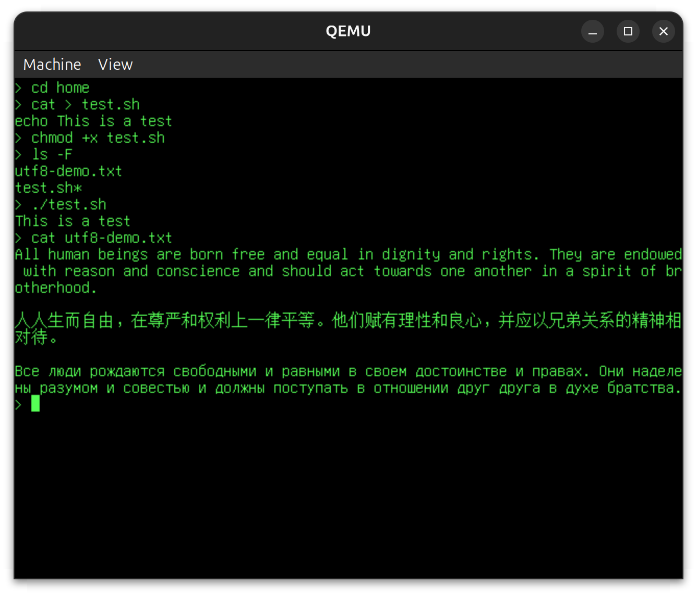

# QEMU Lab

A minimal Operating System for the QEMU emulator.

- FAT filesystem
- Keyboard and virtual console (VirtIO devices)
  - event-based input: pressing an arrow key is one event, not an `\x1b[` escape sequence
- Userspace programs and system calls (with kernel space / userspace separation)
- Pipes and redirection
- UTF-8 and wide character support (input is US QWERTY-only, but UTF-8 files can be read and displayed correctly, subject to Unifont limitations)



## To run

Install QEMU and Rust if you haven't already:

```bash
sudo apt-get install qemu qemu-system-arm qemu-utils rustup just
rustup default stable
rustup target add aarch64-unknown-none-softfloat
```

Then, to run the OS in QEMU:

```bash
cd rust/<stage label>  # Navigate to the specific stage directory of the OS
just run  # Execute the build and run commands for the OS stage
```

Features implemented at each stage are tracked in `ROADMAP.md` (subject to change). Completed stages can be found in the corresponding directories under `rust/`.  A small number of older stages completed in C can also be found in the corresponding directories under `c/` (use the included `run.sh` scripts to launch them).
