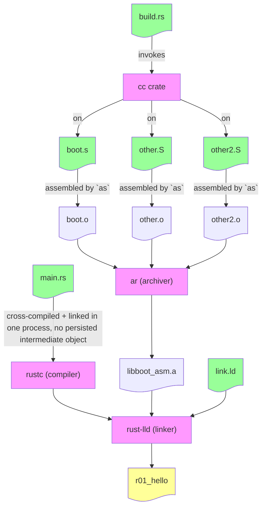

# How the Build Sequence Works in Rust with Assembly Files

```mermaid
graph TD;
    cc@{shape: proc, label: "cc crate"}
    ar@{shape: proc, label: "ar (archiver)"}
    rust-lld@{shape: proc, label: "rust-lld (linker)"}
    rustc@{shape: proc, label: "rustc (compiler)"}

    style cc fill:#f9f
    style ar fill:#f9f
    style rust-lld fill:#f9f
    style rustc fill:#f9f

    build.rs@{shape: doc}
    style build.rs fill:#9f9

    boot.s@{shape: doc}
    other.S@{shape: doc}
    other2.S@{shape: doc}
    style boot.s fill:#9f9
    style other.S fill:#9f9
    style other2.S fill:#9f9

    boot.o@{shape: doc}
    other.o@{shape: doc}
    other2.o@{shape: doc}
    libboot_asm.a@{shape: doc}
    main.rs@{shape: doc}
    style main.rs fill:#9f9
    link.ld@{shape: doc}
    style link.ld fill:#9f9
    r01_hello@{shape: doc}
    style r01_hello fill:#ff9

    build.rs -- "invokes" --> cc -- "on" --> boot.s
    cc -- "on" --> other.S
    cc -- "on" --> other2.S

    boot.s -- assembled by `as` --> boot.o
    other.S -- assembled by `as` --> other.o
    other2.S -- assembled by `as` --> other2.o

    boot.o --> ar
    other.o --> ar
    other2.o --> ar --> libboot_asm.a

    main.rs -- "cross-compiled + linked in one process, no persisted intermediate object" --> rustc --> rust-lld
    libboot_asm.a --> rust-lld
    link.ld --> rust-lld

    rust-lld --> r01_hello
```
