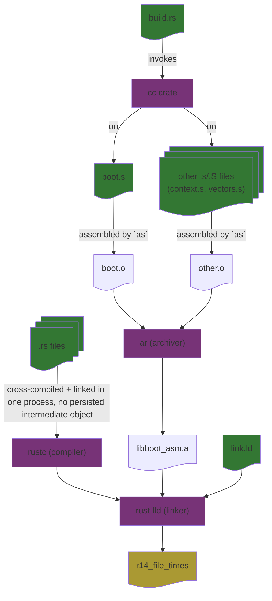

# How the Build Sequence Works in Rust with Assembly Files




## How it is wired together

For the kernel (`rust/r14_file_times/`):

- **The target and linker arguments** are in `.cargo/config.toml`: the build target is
  `aarch64-unknown-none-softfloat`, and `-C link-arg=-Tlink.ld` is how the linker script reaches `rust-lld`.
  `-C force-unwind-tables=no` stops the compiler emitting unwind tables for the kernel's own code (there is no
  unwinding on bare metal), so fewer stray sections can land ahead of the entry point. Some `.eh_frame` data
  still arrives from precompiled library code, which is why `link.ld` places `.eh_frame_hdr` and `.eh_frame`
  explicitly, after `.rodata`, instead of leaving them to be placed anywhere.
- **`build.rs`** finds every `.s`/`.S` file under `src/` (they live in `src/arch/`: `boot.s`, `context.s` and
  `vectors.s`), assembles them with the `cc` crate, and archives them as `libboot_asm.a`, which Cargo links
  into the kernel. It also tells Cargo to rebuild when `link.ld` or anything under `src/` changes.
- **`just build`** runs `cargo build --release` and copies the result out of `target/` as `r14_file_times.elf`, the
  file QEMU's `-kernel` loads. `just build-test` does the same with the `testhooks` feature, as
  `r14_file_times-test.elf` (see [`tests.md`](tests.md)).

## Linking and QEMU ELF file handling

The linker's output is in ELF format (Executable and Linkable Format)

To ensure our kernel's entry point is aligned to the start of RAM, we specify the `_start` symbol at the beginning of our `boot.s` file:

```s
.section ".text.boot"
.global _start
_start:
```

Then, in the linker script (`link.ld`), we specify the entry point using the `ENTRY` directive:

```ld
ENTRY(_start)
```

We then ensure that the `.text.boot` section, which contains our `_start` entry point at its very beginning, is placed at the start of the memory region in the linker script, by specifying its location in the `SECTIONS` command:

```ld
SECTIONS
{
	/* QEMU's "virt" machine loads -kernel images at this address */
	. = 0x40000000;

    /* .text.boot comes from boot.s and must be aligned to
    0x40000000, thus it comes first in our section ordering.

    All other sections come from main.rs or are left empty. */

	.text : { *(.text.boot) *(.text*) }

    /* Other sections... */
} 
```

`readelf -SW` on the built ELF file should thus show the following (abridged; the exact sizes change with every
build):

```
> readelf -SW r14_file_times.elf
There are 11 section headers, starting at offset 0x2507a8:

Section Headers:
  [Nr] Name              Type            Address          Off    Size   ES Flg Lk Inf Al
  [ 0]                   NULL            0000000000000000 000000 000000 00      0   0  0
  [ 1] .text             PROGBITS        0000000040000000 010000 034608 00  AX  0   0 2048
  [ 2] .rodata           PROGBITS        0000000040035000 045000 1e6198 00 AMS  0   0  8
  ...
  [ 5] .data             PROGBITS        000000004021d000 22d000 0016b0 00  WA  0   0  8
  [ 6] .bss              NOBITS          000000004021f000 22e6b0 14112e0 00  WA  0   0 4096
```

This shows that the `.text` section, which includes our `.text.boot` section from `boot.s`, lives at offset `0x10000` in the file, and when loaded in QEMU is placed at the start of the memory region `0x40000000`, as specified in the linker script.

> [!NOTE]
> QEMU doesn't strictly need the entry point to be at the start of the memory region, as it can start execution from any valid entry point within the loaded ELF file. More specifically, the ELF header (offset `0x0` in the ELF file, 64 bytes for 64-bit ELF) contains the entry point address at offset `0x18` (8 bytes), which QEMU uses to determine where to start execution.
>
> However, bare-metal systems generally don't understand ELF headers and expect the entry point to be at the start of RAM; thus we follow this convention and align `_start` with the very start of the `.text` section (in our ELF file) and ensure that section is placed at the start of the memory region (in the `virt` QEMU machine).  For our `virt` QEMU machine, this is `0x40000000`.

See also: [`memory_regions.md`](memory_regions.md) for what lives at `0x40000000` and how the linker script lays the kernel image out, and [`mmu.md`](mmu.md) for how each linked section is then mapped.
