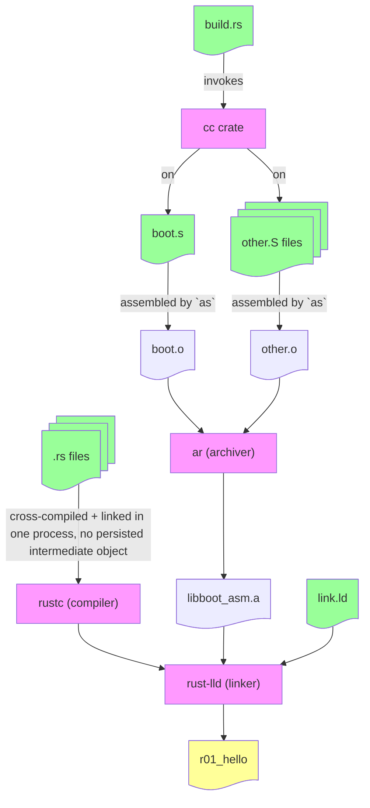

# How the Build Sequence Works in Rust with Assembly Files




## Linking and QEMU ELF file handling

The linker's output is is ELF format (Executable and Linkable Format)

To ensure our entry point is aligned to the start of RAM, we specify the `_start` symbol at the beginning of our `boot.s` file:

```s
.section ".text.boot"
.global _start
_start:
```

Then, in the linker script (`link.ld`), we specify the entry point using the `ENTRY` directive:

```ld
ENTRY(_start)
```

We then ensure that the `.text.boot` section, which contains our `_start` entry point at its very beginning, is placed at the start of the memory region in the linker script, by specifying its location in the `SECTIONS` command:

```ld
SECTIONS
{
	/* QEMU's "virt" machine loads -kernel images at this address */
	. = 0x40000000;

    /* .text.boot comes from boot.s and must be aligned to
    0x40000000, thus it comes first in our section ordering.

    All other sections come from main.rs or are left empty. */

	.text : { *(.text.boot) *(.text*) }

    /* Other sections... */
} 
```

`readelf -SW` on the built ELF file should thus show the following:

```
> readelf -SW r06_virtio.elf 
There are 11 section headers, starting at offset 0x25570:

Section Headers:
  [Nr] Name              Type            Address          Off    Size   ES Flg Lk Inf Al
  [ 0]                   NULL            0000000000000000 000000 000000 00      0   0  0
  [ 1] .text             PROGBITS        0000000040000000 010000 008d04 00  AX  0   0 2048
```

This shows that the `.text` section, which includes our `.text.boot` section from `boot.s`, lives at offset `0x10000` in the file, and when loaded in QEMU is placed at the start of the memory region `0x40000000`, as specified in the linker script.

> [!NOTE]
>
> QEMU doesn't strictly need the entry point to be at the start of the memory region, as it can start execution from any valid entry point within the loaded ELF file. More specifically, the ELF header (offset `0x0` in the ELF file, 64 bytes for 64-bit ELF) contains the entry point address at offset `0x18` (8 bytes), which QEMU uses to determine where to start execution.
>
> However, bare-metal systems generally don't understand ELF headers and expect the entry point to be at the start of RAM; thus we follow this convention and align `_start` with the very start of the `.text` section (in our ELF file) and ensure that section is placed at the start of the memory region (in the `virt` QEMU machine).  For our `virt` QEMU machine, this is `0x40000000`.
