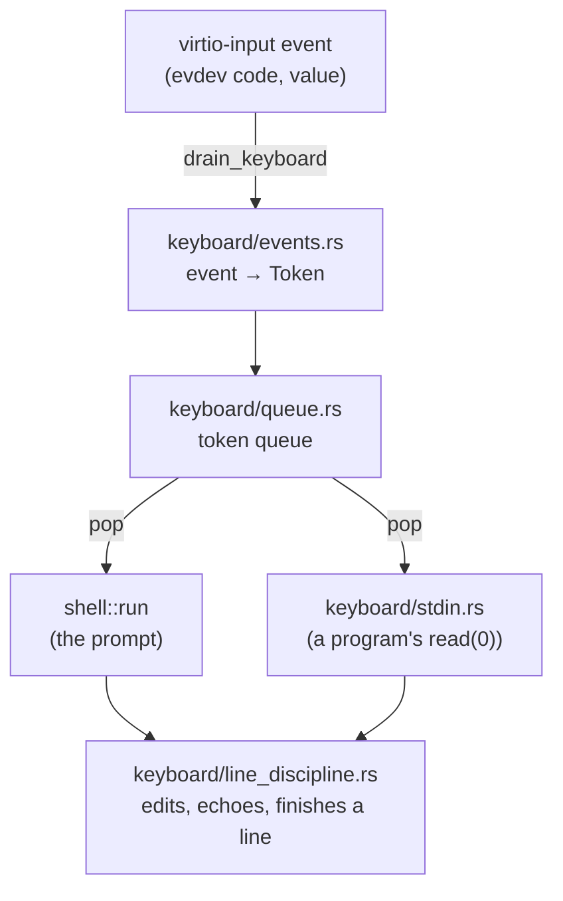

# The console: keyboard input, line editing and modes

This document covers the *input* side of the console: how a key press becomes an edited line, and what
the two ways of reading a line (`Mode::Prompt` and `Mode::Canonical`) do differently. Drawing text on the
screen &mdash; the Unicode font, wide cells, the xterm-style cursor wrap &mdash; is described under "Font
handling" in [`virtio.md`](virtio.md). The shell that consumes the prompt's lines is described in
[`shell.md`](shell.md).

## From key press to line

- **Events to tokens** (`keyboard/events.rs`, `tokens.rs`, `keymap.rs`). The virtio keyboard reports Linux
  *evdev* key codes, not scancodes or bytes. `keymap.rs` tracks which keys are held and which locks are on;
  a genuine key-down of a non-modifier key becomes a `Token { code, shift, ctrl, alt, caps }`. Repeats and
  releases produce nothing (`KeyState::set` reports whether the held set actually changed, so a resent press
  is a no-op too). A `Token` names *which key* was pressed with the modifiers held at that moment; what that
  means (`Ctrl+A` is "go to the start of the line") is decided by whoever consumes it.
- **No escape sequences.** Input never arrives as a byte stream, so there is no ANSI/CSI decoding anywhere:
  the Left arrow is one `Token` (`KEY_LEFT`), not `ESC [ D`. This is a deliberate departure from a real
  terminal, which has to re-encode structured key events as bytes for a serial-port-shaped device.
- **The token queue** (`keyboard/queue.rs`). A 256-token ring buffer (16 in the `testhooks` test build; see [`tests.md`](tests.md)) between whoever learns of a key press
  and whoever reads it. The keyboard interrupt handler only *fills* it, so no shell code can be re-entered
  from an interrupt, which is what lets programs run with interrupts enabled: a key pressed while one runs
  simply waits, in order, for the next reader. If the queue fills, the newest presses are dropped, with one
  note on the UART per burst. The readers are the shell's loop (`shell::run`) and a program blocked in
  `read(0)` (`keyboard/stdin.rs`, which fetches from the device itself, since IRQs are masked inside a
  syscall).
- **Signal keys never get this far.** `Ctrl+C` and `Ctrl+Z` are meant to be recognized by the queue's
  producer, before a token is queued (Stages 20&ndash;22), so the line discipline never sees them in either
  mode. `Ctrl+D` is different: end-of-file is a property of reading a line, so it is handled here.

## The line discipline

`keyboard/line_discipline.rs` turns a stream of tokens into an edited line on the console. One instance
serves the one console, and is used by two callers:

| Caller | Prefix drawn before the line | Mode |
|---|---|---|
| the shell's prompt (`shell::start_prompt`) | `> ` | `Mode::Prompt` |
| a program's `read(0)` (`keyboard/stdin.rs`) | none | `Mode::Canonical` |

Its parts (each one file under `keyboard/`):

- `line.rs` &mdash; `LineBuffer`: the text of the line being typed and the cursor's byte offset into it
  (always on a `char` boundary). Pure logic, tested on the host.
- `history.rs` &mdash; `History`: the prompt's command history. Pure logic, tested on the host.
- `line_discipline.rs` &mdash; `LineDiscipline`: owns a `LineBuffer` and a `History`, knows which console
  row the line starts on, decides how each key is handled in the current `Mode`, and redraws.
- `stdin.rs` &mdash; hands a running program one finished line at a time.

`LineDiscipline::handle(token)` returns what the key did:

| Outcome | Meaning |
|---|---|
| `Ignored` | Nothing that shows: a modifier, an unbound key, Backspace on an empty line, a no-op like Left at column 0. |
| `Edited` | The line's text or cursor changed and was redrawn; the display needs a flush. |
| `Finished(text)` | Enter: the console has moved to the next row and the UART transcript has the line. |
| `Partial(text)` | `Ctrl+D` on a non-empty line in `Mode::Canonical`: what was typed so far, *without* a newline. |
| `EndOfFile` | `Ctrl+D` on an empty line in `Mode::Canonical`. |

> [!NOTE]
> Neither mode is "raw mode". That term is reserved for a full-screen editor that reads tokens directly and
> bypasses the line discipline entirely (Stage 13). Both modes here stay inside the same model: keys edit a
> line, and Enter finishes it. `Mode::Prompt` just recognizes more keys.

## Prompt vs Canonical mode

`Mode::Prompt` is a readline-style editor for the shell's own prompt: a movable cursor and command history.

`Mode::Canonical` is what a real terminal does for a program's `read(0)`, the POSIX "canonical mode": you
type a line, Backspace erases its last character, `Ctrl+U` discards the whole line, `Ctrl+D` is end-of-file,
and Enter delivers the line (plus a newline). There is no cursor movement, no history, and nothing typed
there is ever recorded. The cursor is always at the end of the line, which is why several editing keys need
no special handling for it: Backspace ("erase before the cursor") and `Ctrl+U` ("erase from the cursor to
the start") do exactly the right thing in both modes.

### Token handling by mode

Every special key, and what it does in each mode. "Nothing" means the key produces `Ignored`: either it
isn't recognized at all outside `Mode::Prompt` (movement, `Ctrl+A/E/K`), or it is a real POSIX gap (no
forward-delete or kill-to-end in canonical mode).

| Token | `Mode::Prompt` | `Mode::Canonical` |
|---|---|---|
| Printable character | insert at the cursor | insert at the cursor (append &mdash; the cursor is always at the end here) |
| Enter | finish the line, run it | finish the line, deliver it to the reading program |
| Backspace | erase the character before the cursor | same operation &mdash; erases the last character, since the cursor is always at the end here |
| Delete | erase the character at/after the cursor | nothing &mdash; no forward-delete in POSIX canonical mode (and nothing past the cursor to erase anyway) |
| Left | move the cursor left one character | nothing |
| Right | move the cursor right one character | nothing |
| Home | move the cursor to the start of the line | nothing |
| End | move the cursor to the end of the line | nothing |
| Up | recall the previous history entry | nothing |
| Down | recall the next history entry, or return to the in-progress line | nothing |
| Ctrl+A | move the cursor to the start of the line | nothing |
| Ctrl+E | move the cursor to the end of the line | nothing |
| Ctrl+U | erase from the cursor to the start of the line | POSIX KILL: discard the whole line &mdash; the same operation as Prompt's, since the cursor is always at the end here |
| Ctrl+K | erase from the cursor to the end of the line | nothing &mdash; no POSIX KILL-to-end character |
| Ctrl+D | nothing &mdash; the shell is init and never exits on EOF | end-of-file if the line is empty; on a non-empty line, delivers what's typed so far *without* a newline instead (a further Ctrl+D on the now-empty line is then EOF) |

Home and End (and `Ctrl+A`/`Ctrl+E`) move to the start and end of the *logical* line, not of the current
screen row, as in bash: on a line wrapped over several rows they jump across rows.

### History

The prompt keeps the last 64 non-empty lines. Up/Down replace the line being edited (saving the in-progress
line the first time Up is pressed, and restoring it when Down walks back past the newest entry). It is
append-only: a recalled line that is edited and run is added as a *new* entry and never rewrites the old
one, and only a line identical to the *most recent* entry is skipped (so re-running an older command still
records it). Editing a recalled line and then pressing Up/Down again discards the edit and continues from
the stored entry. (Real bash keeps such an edit alive while you keep browsing, until that line is actually
submitted; this shell deliberately keeps less state.)

### `Ctrl+D`'s two halves

At the prompt `Ctrl+D` does nothing: a POSIX interactive shell exits on end-of-file, but this shell is the
init process and never exits. In canonical mode it is the POSIX rule: on an empty line it is end-of-file
(`read` returns 0, so `cat` with no arguments can stop); on a non-empty line it flushes what has been typed
to the reader without a newline, and the *next* `Ctrl+D` on the now-empty line is end-of-file.

## Drawing the line

The line discipline draws the prefix and the line itself, using `Console` (see `virtio.md`):

- **Wrapping.** A line longer than a row wraps onto the rows below it. `console/input_layout.rs` computes the
  layout by replaying exactly what `Console::write_char` does (the same `Cursor`), so layout and drawing
  cannot disagree. A line may use at most `rows - 1` rows; a character that would grow it past that is
  dropped.
- **Two kinds of redraw.** An edit that changes the text clears and rewrites the line's rows. A pure cursor
  move touches only two cells: it redraws the old cursor cell normally, then draws the new one.
- **The cursor** is drawn as an ordinary glyph with its foreground and background swapped (inverse video),
  over whatever character is actually there, or a space past the end of the text. It follows xterm's
  deferred-wrap rule: at the very end of text that exactly fills a row, it stays on that row's last column
  instead of jumping to a row nothing has been drawn on yet.
- **Finishing.** When a line ends (Enter, or either `Ctrl+D` case in canonical mode) the cursor cell is
  drawn back to normal, because nothing redraws a finished line's row again.

## Where the code lives

| File | What it holds |
|---|---|
| `keyboard/events.rs`, `tokens.rs`, `keymap.rs` | Events to `Token`s; held-key and lock state; key names |
| `keyboard/queue.rs`, `ring_buffer.rs` | The token queue and the ring buffer under it |
| `keyboard/line.rs` | `LineBuffer`, `Mode`, `LineEvent` |
| `keyboard/history.rs` | `History` |
| `keyboard/line_discipline.rs` | `LineDiscipline`, `LineOutcome` |
| `keyboard/stdin.rs` | `read(0)` for a program |
| `console/input_layout.rs` | Where a line and its cursor land on the screen |
| `console/mod.rs`, `cells.rs`, `font.rs`, `utf8.rs` | Drawing: cells, glyphs, the cursor, UTF-8 decoding (see `virtio.md`) |
