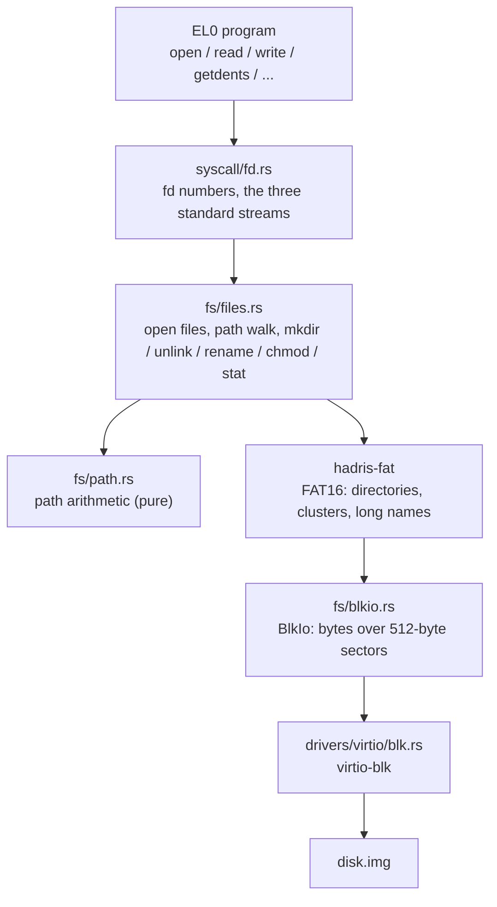

# The filesystem

Programs see a single FAT16 volume mounted at `/`. The kernel does not implement FAT itself: the
[`hadris-fat`](https://crates.io/crates/hadris-fat) crate does, and `rust/<stage>/src/fs/` is the glue
between it, the block device below and the syscalls above.

## The volume

- **The image.** `just disk` builds a 64 MiB FAT16 image from the stage's `disk/` directory
  (`folder_to_img.sh`: `mkfs.fat` plus `mtools`), so `disk/bin/cat` lands at `/bin/cat` (`cat.exe` before Stage 17). The volume
  serial and file timestamps are pinned, so the same inputs give a byte-identical image. The layout the shell
  relies on is `/bin` (programs) and `/tmp` (pipeline temp files; the shell needs it to exist); the image also
  carries `/tests` (test programs and fixtures), `/fonts` and whatever else is in `disk/`. From Stage 17 it also
  carries **`/etc/environment`** (the shell's initial environment, `NAME=VALUE` lines read once at boot: `HOME=/root`,
  `TZ`, `PATH=/bin`, `PS1`) and **`/root`**, the home directory (it was `/home` before Stage 17, renamed for the single
  root user Linux would also give one): until Stage 19 a demo text file and `/root/.profile`, the start-up script (see
  [`shell.md`](shell.md)); from Stage 19 an **empty directory**, the mount point of the `HOME` disk (**`/etc/fstab`**, read by the
  shell at start-up), whose demo file and profile come from the seed the disk was made from (`just home-disk`). The kernel
  never names `/root` or `/home`; only the environment file's `HOME` does.
- **Mounting.** `kernel_main` opens the root volume once, over a `BlkIo` (below), into the static `VOL` (before Stage 19; see "Mounts"), and it stays
  mounted for the kernel's whole life. Everything else re-derives directories and files from it on each lookup;
  nothing else is cached. Until Stage 19 there is one volume: no mount points, no other filesystems. **From Stage 19** the
  kernel finds every block device and reads each one's boot sector (below), the root is chosen among them, and the others
  can be mounted on directories ("Mounts", below); `VOL` became one open volume per device.
- **The executable bit.** FAT has no execute permission, so this project claims one of the attribute byte's
  unused bits, `ATTR_EXEC` (`0x40`), alongside the real FAT ones. At boot the kernel sets it on every file in
  `/bin`; nothing else is executable until `chmod +x`. See [`launching_programs.md`](launching_programs.md).

## Which disk is which: `fs/devices.rs`

**From Stage 19** there may be several virtio-blk devices (up to four are driven, in the order the device tree lists
their virtio-mmio slots; QEMU fills the slots in the reverse of the command-line order, so the order says nothing a
person chose). A device is therefore identified by what is on it, never by its number. At boot, after the devices'
interrupts are on, `devices::probe` reads sector 0 of each one and `fs/bootsector.rs` (pure, host-tested) parses it
as a FAT boot sector: the **volume label** (up to 11 characters, `NO NAME` counting as none, as it does for `blkid`)
and the **volume ID**, the 32-bit serial `mkfs.fat -i` and `mlabel -N` set, which Linux shows as the `UUID` of a vfat
volume (`XXXX-XXXX`). Its offsets differ for FAT12/16 and FAT32 and are told apart as the specification says (a
device that is blank, random, exFAT or NTFS parses as "not a FAT volume"). The table is logged on the serial port
(`Block devices: 2`, then one line each) and reported to programs by the `blkinfo` syscall
([`syscalls.md`](syscalls.md)), which `lsblk` prints.

The **root** is the volume labelled `SYSTEM` -- the first, if several are -- and failing that the first FAT volume, so
an image built before the label existed (`R12SH`) still boots on its own; a device that is not FAT is never the
root. Only the root is opened as a filesystem (over a `BlkIo` on that device); nothing writes to the others.

**The host side (Stage 19).** `just disk` labels the system image `SYSTEM` and rebuilds it on every run. The second
disk, `home.img`, is the opposite: `just home-disk` creates it **once** (32 MiB FAT16, label `HOME`, a random volume ID)
from the folder `disk-home-seed/` and never touches it again, `just run` attaches it beside the system image, and
`just home-reset` throws it away and recreates it. The seed folder is only the starting content of a new disk, not
something kept in step with `home.img`. The host must not read or write `home.img` (with `mtools`, say) while QEMU has it
open: the guest can be part-way through an update.

## Mounts (Stage 19)

`fs/mounts.rs` keeps one open `FatVolume` per mounted device and a **mount table** (`fs/mounttable.rs`, pure and
host-tested): a list of `(mount point, device)`, the root (`/`) first. Every path reaches `fs/files.rs` already absolute
and normalized, and the first thing each operation does is `resolve` it: the mount whose point is the longest match on
a whole component (`/root` covers `/root/a` but not `/rootbeer`), and the rest of the path, looked up from that volume's
own root. There is nothing special for `..`, which is gone before a path gets there, so going up from a mount's root
is going up in the path. An open file remembers its device, which is how `umount` knows a volume is in use.

- **Mounting** (`mount`, `umount`; the syscalls and programs of the same names) takes `LABEL=name` or `UUID=XXXX-XXXX`,
  finds the device by what its boot sector says, and needs an existing directory to mount on. A mounted directory's old
  contents are hidden, not gone: they come back at `umount`. A volume is mounted once, a point holds one mount, and mounts
  nest (a mount point inside a mounted volume).
- **What a mount point is.** `stat` and `ls` of it show the mounted volume's root; the entry in its *parent's* listing is
  the hidden directory. It cannot be removed or renamed (`EBUSY`), nor can `umount` take it away while a working
  directory or an open file is inside it, or another mount.
- **Two volumes are two filesystems.** A `rename` between them is `EXDEV`, checked before anything is touched (a program
  copies and removes instead); every other operation stays on the volume its path resolves to. Everything `getdents`
  lists for a directory is that volume's, so `find /` and `ls -R /` walk straight across mount points.
- **Nothing is cached** (`BlkIo` writes through), so unmounting has nothing to flush: the volume is dropped, and what
  was written is on its disk already.

**The rules, in one place.** A path goes to the mount with the **longest point** that matches it on a whole component.

| | |
|---|---|
| Mount on a directory | It must exist as a directory on the volume the path resolves to (`ENOENT`, `ENOTDIR`). Its old contents are hidden until `umount`. |
| Mount on a **subdirectory of a mount** | Allowed. The directory is looked up on the mounted volume, so it must exist there. Mounts nest. |
| Mount on a mount point | `EBUSY`: a point holds one mount. |
| Mount on a **parent of a mount** | `EBUSY`: a mount cannot cover another mount. (Mounting on `/p` is fine while nothing is mounted under it.) |
| Mount a volume that is mounted already | `EBUSY`: a volume is mounted once. |
| `umount` | Only the exact mount point (`EINVAL` otherwise). `EBUSY` for the root, for a mount with another mounted inside it (innermost first), for a volume with an open file on it, and for one that any shell frame's working directory is inside. |
| `unlink`, `rmdir`, `rename` of a mount point | `EBUSY`. (`rm -r` on one removes the volume's contents and then fails there, as GNU `rm` does.) |
| `rename` between two volumes | `EXDEV`, before anything is changed. |

These are **stricter than Linux** in three places, on purpose, to keep the table a simple list of unique points: Linux lets
you mount again on a point (the new mount hides the old, which returns when it is unmounted), lets you mount on a parent
of a mount (the inner mount stays, hidden), and lets one device be mounted at several points. It also crosses into a
mount while walking a path one directory at a time, where the table matches the whole path by prefix; the answers agree for
every rule above. Other differences: `stat` of a mount point shows the mounted volume's root with the FAT epoch for its
times (a FAT root has no entry of its own), sources are only `LABEL=` and `UUID=` (no `/dev` paths), and `umount` has
no lazy form. Nothing planned needs any of them.

## Getting bytes to the disk: `BlkIo`

`fs/blkio.rs` presents the block device to `hadris-fat` as one flat, byte-addressable stream from byte 0 to
the end of the disk (`Read + Write + Seek`); `hadris-fat` decides for itself which byte ranges are the FAT
tables, directory entries or file data. The device only does whole 512-byte sectors, so every read fetches the
sector containing the position, and every write is a **read-modify-write** of a sector: read it, patch the
bytes, write it back. Nothing is buffered, so every write has reached the device when it returns (`flush` has
nothing to do). It goes through the shared `BLK` statics (one entry per device; a `BlkIo` holds the index of its own, from Stage 19), whose completion interrupts are handled in the IRQ
handler (see [`virtio.md`](virtio.md)).

## Paths

`fs/path.rs` (`abspath`) is pure string arithmetic, tested on the host. It turns what a user typed into the
absolute, normalized path the rest of the module resolves: relative paths start at the working directory,
`.` and empty components vanish, `..` removes the component before it (and stays at the root), and a trailing
`/` is ignored. It never touches the disk, so it never checks that anything exists.

- A component longer than `NAME_MAX` (255) or a path longer than `PATH_MAX` (4096) is `ENAMETOOLONG`; an empty
  path is `ENOENT`.
- `files.rs` then walks the components from the root, one directory at a time, matching each name **exactly
  and case-sensitively** &mdash; unlike FAT itself, which folds case, so `cat HELLO.TXT` does not find
  `hello.txt`. Long file names (up to 255 characters) work; the short 8.3 name every entry also has
  must still be unique in its directory.
- There are no symbolic links and no hard links, which is what makes purely lexical `..` correct. `.` and `..`
  entries in FAT directories are never listed.

## Open files

`syscall/fd.rs` owns the small file-descriptor numbers a program sees (0, 1 and 2 are the standard streams;
the rest refer to files). `fs/files.rs` owns what they refer to: an **open file**, of which at most **13**
(`MAX_OPEN_FILES`) can exist at once, counting the shell's own redirect files. Each is one of:

| Kind | Opened by | Used by |
|---|---|---|
| Reader | `open` for reading a file | `read` |
| Writer | `open` for writing a file | `write` |
| Directory | `open` for reading a *directory* | `getdents` |

`open` fails with `EMFILE` when 13 are already open. An open file is **shared, not owned by one fd**: it is a
reference-counted object (`Rc<RefCell<OpenFile>>`, `FileRef`), and every fd slot or stream binding that
refers to it holds a reference. `2>&1` makes fds 1 and 2 hold the same file; a redirected program's fds 0&ndash;2
share the file with the shell's own binding of it. The rules:

- **Reading.** A directory can be opened read-only, and its entries are **snapshotted** at that moment.
  `read` on a directory is `EISDIR`; `getdents` on an open file is `ENOTDIR`.
- **Writing.** Opening for write creates the file if it is missing and empties it, unless `append` (`O_WRONLY |
  O_APPEND`) starts at the current end. A directory is `EISDIR`; a read-only file is `EACCES`. `hadris-fat`
  refuses a second writer on the same file.
- **`close` is what commits a write.** A writer's final size reaches the directory entry only when it is closed
  (`FileWriter::finish`), which is why each redirect target and pipe end is released before the next
  command reads it. There is no `seek`, and no separate truncate.
- **Closing.** `close(fd)` empties the slot and drops that reference. Only the *last* reference really closes
  the file (and commits a writer, so only then can `close` report `EIO`); closing one of several fds leaves the
  file open for the rest, so a program that closes stdout under `> f 2>&1` still writes to `f` through stderr.
- **Ending a program.** When a program exits or faults its fd table is dropped, which releases every
  reference it held, so a crashed program cannot leak files; a file that only it held is closed and committed
  then (an error, having no one to report to, is dropped). A file the shell also holds, a redirect target,
  stays open until the shell's binding goes at the end of the redirected command (see
  [`shell.md`](shell.md)).

### Concurrent access to one file (a known limitation)

The kernel does not coordinate different `open`s of the same file, and today nothing needs it: one program
runs at a time, and the shell never reads and writes one path at once. What it does and does not do:

- One fd is one mode: a reader or a writer, never both (`open` has no read-write mode). Fds that share a
  `FileRef` (`2>&1`, a redirect) share one position; separate `open`s of a path have separate positions.
- A file can have any number of readers, but **only one writer**: `hadris-fat` refuses a second
  `FileWriter` on the same directory entry. That refusal reaches the program as `EIO`, not as an error
  that says what happened.
- **Readers and a writer on the same file are allowed together, and nothing stops them from interfering.**
  A reader keeps the size it saw when it opened and never picks up later writes. `write` puts data on disk
  at once but the directory entry's size and cluster chain change only at `finish`, and opening a writer
  empties the file by overwriting the *same* clusters. So a reader open while a writer rewrites or
  truncates the file sees new bytes mixed with old ones. If the file shrinks within its last cluster, it
  also reads the stale bytes past the new end. If it shrinks across a cluster boundary, the freed clusters
  are gone from the chain: the reader gets `EIO`, or, if another file has since been given those clusters,
  reads that file's bytes. `hadris-fat` revalidates the entry on each read, but only by short name and creation
  time, which catches a deleted file yet not a rewritten one (a delete-and-recreate within the same second
  gets the same creation stamp, so it is not caught either).
- `unlink` and `rename` do not look at open fds either.
- FAT has no inodes, so there is no Unix behaviour to imitate, where an open file keeps its old contents after
  it is truncated or unlinked. The options are refusal or stale data.
- A running program does not hold its file open (the launcher reads the whole file into memory), so
  overwriting a running program's file is harmless.

**The fix, for Stage 21** (when two programs can be resident, so the interference becomes reachable):
track which directory entries (parent cluster plus offset, which is how `hadris-fat` keys its own writer
check) have open readers or a writer, and refuse the conflicting `open`, `unlink` or `rename` with `EBUSY` --
readers-XOR-one-writer, a sharing-violation model. That needs `EBUSY` (-16) added to `abi`'s errno table
and its `errmsg`, and the second-writer `EIO` mapped to it too. Detecting a change on disk instead is
weaker (see `Stage12.md`, "Deliberately not done here") and is not the plan. `cat f > f` would then fail
with `EBUSY` instead of silently emptying `f`.

## Directory listings

`getdents` fills the caller's buffer with fixed-size records, as many as fit:

| Bytes | Field |
|---|---|
| 0&ndash;3 | file size, `u32`, little-endian |
| 4 | attribute byte |
| 5 | name length |
| 6&ndash;260 | the name, NUL-padded to `NAME_MAX` (255) |

That is `DIRENT_SIZE` = 261 bytes per entry. Entries come in **on-disk order, not sorted** (`ls` sorts them itself from Stage 16, having the heap to do it in); the volume-label
pseudo-entry, `.` and `..` are skipped. The buffer must hold at least one record: a smaller one is `EINVAL`,
because the `0` that would otherwise come back means &ldquo;no more entries&rdquo; and a caller with a
too-small buffer would silently see an empty directory (Linux does the same).

## Attributes and permissions

The attribute byte is FAT's own, plus the one claimed bit. The table lists the bits the kernel gives meaning to; the
raw byte is passed through to `getdents` and `stat`, so others (hidden `0x02`, system `0x04`, archive `0x20`, which
`mtools` sets on copied files) can appear too:

| Bit | Name | Meaning |
|---|---|---|
| `0x01` | `ATTR_READ_ONLY` | Refuses opening for write (`EACCES`) |
| `0x08` | `ATTR_VOLUME_LABEL` | The volume-label pseudo-entry; never listed |
| `0x10` | `ATTR_DIRECTORY` | A directory |
| `0x40` | `ATTR_EXEC` | Executable (not standard FAT) |

`chmod` may change only `ATTR_EXEC` and `ATTR_READ_ONLY`, since the other bits say what an entry *is*, not what
it permits; anything else is `EINVAL`. That is the whole permission model: there are no users, groups or read
bits. The read-only bit gates *opening for write* but deliberately not deleting or renaming: those are governed
by the containing directory alone, as for a privileged process on Unix.

## Other operations

| Operation | Behavior |
|---|---|
| `mkdir` | The parent must exist (`ENOENT`, or `ENOTDIR` if a component is a file) and the path must not (`EEXIST`); an invalid name is `EINVAL`. |
| `unlink` | Removes a file, or with `AT_REMOVEDIR` an empty directory (`EISDIR`/`ENOTDIR` if the kind doesn't match, `ENOTEMPTY` if it isn't empty). Paths are normalized first, so `.` and `..` name the current and parent directory; a path that normalizes to `/` is `EINVAL`. |
| `rename` | A literal rename or move within the volume: refuses if the destination already exists (`EEXIST`), and refuses moving a directory into itself or a descendant (`EINVAL`). `/` as either path is `EISDIR`. "Move into an existing directory" and "replace a file" are `mv`'s job, built in userspace on `stat` + `rename` + `unlink`. |
| `stat` | Every field a FAT entry stores: size, attributes, created/modified date-time, accessed date. Dates are FAT's packed encoding, not calendar values; the root has no entry of its own and reports size 0, directory, and the FAT epoch. |
| `chmod` | As above. |

**Reading never updates a timestamp, the accessed date included.** The accessed date is set when an entry is created and
when a writer finishes (`hadris-fat` sets it to the modified date), and no read, `cat` and `open` for reading included,
rewrites the directory entry. So the accessed date is never newer than the last write, and always the date of the modified time, which is why Stage 15's `stat` does not show it (Stages 12-14's did). It is still stored, and `newfstatat` still returns it. This is
Linux's `noatime` behaviour, and Windows has defaulted to it since Vista: FAT's accessed field is only a date, and updating
it would cost a directory write for every read. (A `relatime`-style update on the first read of each day would be one write per
file per day, through `FatVolumeWriteExt::set_times`; it is not done.)

Timestamps are what is stored. Anything the kernel creates or writes is stamped from the real-time clock
(`fs/rtc_time.rs`, handed to `hadris-fat` when the volume is mounted): creating a file or directory sets its
created and modified times, writing moves the modified time, and the accessed date is today's. **They are UTC.**
FAT has no time-zone field and Windows reads the fields as local time, but the kernel never interprets a stamp:
it writes what the clock says and `stat` hands the fields back raw, so reading and writing agree, as on Linux with
`mount -o tz=UTC`. Turning a stamp into a user's local time is a display matter for the program that prints it
(`stat`, as of Stage 15, converts to `America/Toronto` like `date` does, and Stage 17's `$TZ` supplies the zone), and the stored bytes do not change with the zone. FAT holds 1980 to 2107 in 2-second steps
(the created time also has a 10 ms field, which carries the odd second), so a clock outside that range, or an
unset RTC reading 1970, is clamped whole to the nearest end (`fs/fattime.rs`, host-tested). Files bundled into the
image keep the fixed stamp `folder_to_img.sh` gave them; this stage's `just disk` builds the image with `TZ=UTC` (mtools writes the stamp as local time), so it is identical on every host.

`mkdir`, `unlink` and `rename` map `hadris-fat`'s errors through one function (`map_fat_err`): `AlreadyExists` to
`EEXIST`, `DirectoryNotEmpty` to `ENOTEMPTY`, `InvalidPath`/`InvalidFilename` to `EINVAL`, `NoFreeSpace`/
`DirectoryFull` to `ENOSPC`, and everything else to `EIO`. Every other operation (`open`, including creating a
file, `write`, `close`, `chmod`) reports any failure as plain `EIO`, so a full disk during a write or a create
shows up as `EIO`, not `ENOSPC`.

## Not supported

Symbolic and hard links, permissions beyond the two bits above, `seek` on an open file, more than one volume,
and case-insensitive names.

## Where the code lives

| File | What it holds |
|---|---|
| `fs/blkio.rs` | `BlkIo`, one per device (and, before Stage 19, the `VOL` static, the mounted volume) |
| `fs/devices.rs`, `fs/bootsector.rs` | The block devices found and each one's label and volume ID; choosing the root (Stage 19) |
| `fs/mounts.rs`, `fs/mounttable.rs` | The open volumes and the mount table: `mount`, `umount`, resolving a path to a device (Stage 19) |
| `fs/files.rs` | Open files (`FileRef`) and every operation above |
| `fs/path.rs` | `abspath` (pure, host-tested) |
| `fs/mod.rs` | `find_entry_checked` (look up one name in a directory) and `read_file_checked` (read a whole file into a `Vec`) |
| `syscall/fd.rs` | The fd table, holding references to the files above; where `read`/`write`/`open` enter |
| `user/abi/src/fs.rs` | The shared constants: open flags, `NAME_MAX`/`PATH_MAX`, `DIRENT_SIZE`, the attribute bits |
