# The MMU and the user memory window

## The Memory Management Unit (MMU)

The MMU maps virtual addresses to physical addresses, controlling access permissions and memory
attributes for different regions. In this project, it sets up page tables for the kernel and a
fixed user window, ensuring that the kernel and user programs have the correct memory access rights.

For simplicity, this project uses a single shared **identity-mapped** page table
for the kernel and a fixed user window, avoiding the complexity of per-process page tables and
ASIDs (Address Space Identifiers).  Identity mapping means that virtual addresses are the same as
physical addresses, simplifying address translation and access control.

The memory layout is defined in `mmu::enable`, where the kernel and user regions are mapped with
appropriate attributes.  Since there is only one shared page table (between the kernel and one user
program at a time), there is a single `aarch64_paging::IdMap` instance that governs all address
translations &mdash; this is assigned an ASID of 0.

Four system registers/settings come up repeatedly below:

- **`TTBR0_EL1`** (Translation Table Base Register 0): holds the physical address of the root page
  table used for the *lower* virtual address range. This project's one table lives here, and covers
  every address it uses.
- **`TTBR1_EL1`** (Translation Table Base Register 1): the same, for the *upper* virtual address
range. Unused here: `TCR_EL1.EPD1` disables table walks through it.
- **`TCR_EL1`** (Translation Control Register): describes the translation regime the tables were
  built for &mdash; how many address bits are translated (`T0SZ`), the page granule size, how the
  table walks themselves are cached and shared, the physical address size, and whether `TTBR1_EL1`
  is walked at all.
- **`SCTLR_EL1.M`** (bit 0 of the System Control Register): the master switch for stage-1 address
  translation at EL1 and EL0. While it is clear the CPU ignores the page tables entirely and every
  address is its own physical address.

> [!NOTE]
> Stages 9&ndash;11 built these same tables but never configured `TCR_EL1` or set `SCTLR_EL1.M`, so
> translation stayed **off** and none of the permissions below were actually enforced. Stage 12's
> Step 3 is where it is genuinely switched on (see "Turning translation on" below).

We also define the root level of the page table hierarchy as 1, which creates a three-level page
table structure (4 KiB level-3 pages, 2MiB level-2 blocks, and 1 GiB level-1 blocks, with 512
entries per table meaning the level-1 table can cover 512 GiB of virtual address space).  Finally,
the regime of the `IdMap` is set to `El1And0`, meaning it governs address translations for both EL1
(kernel) and EL0 (user) levels, the only two levels our `virt` QEMU setup uses.

```rust
use aarch64_paging::{idmap::IdMap, paging::El1And0};

const ROOT_LEVEL: usize = 1;
const ASID: usize = 0; // Only ever one address space -- no per-process ASIDs needed.

let mut idmap = IdMap::with_asid(ASID, ROOT_LEVEL, El1And0);
```

### Mapped region attributes

`aarch64_paging::descriptor::El1Attributes` defines the following memory attributes for page table 
entries:

- `ATTRIBUTE_INDEX_0`: Read attribute bits from slot 0 in the MAIR_EL1 register.
- `ATTRIBUTE_INDEX_1`: Read attribute bits from slot 1 in the MAIR_EL1 register.
- `VALID`: Marks the entry as valid.
- `ACCESSED`: Marks the entry as accessed.
- `USER`: Makes the page accessible from EL0 (without it, only EL1 may touch it).
- `UXN`: Unprivileged Execute Never -- prevents execution at EL0.
- `PXN`: Privileged Execute Never -- prevents execution at EL1.
- `INNER_SHAREABLE`: Marks the memory as coherent across every observer in the same inner shareable
  domain -- every CPU in the same coherent cluster, plus any DMA-capable agent considered part of
  that same interconnect.

  - A VirtIO device's *register window* (the 0x200-byte `virtio-mmio` slot the CPU pokes to
  configure it) is *not* marked as inner sharable;
  - The data it *actually DMAs to/from* (`drivers/virtio/hal.rs`'s `DMA_POOL`, which holds the
  virtqueues and the framebuffer; a disk read or write uses a buffer on the caller's stack) is
  ordinary RAM, and is inner shareable.

- `READ_ONLY`: Marks the memory as read-only.

Our `MAIR_EL1` register is configured with `MAIR_NORMAL` in slot 1 and `MAIR_DEVICE_NGNRE` in slot 0:

```rust
const ATTR_DEVICE_INDEX: u64 = 0;
const ATTR_NORMAL_INDEX: u64 = 1;

const MAIR_DEVICE_NGNRE: u64 = 0b0000_0100;
const MAIR_NORMAL: u64 = 0xff;

MAIR_EL1.set(
    (MAIR_DEVICE_NGNRE << (8 * ATTR_DEVICE_INDEX)) | (MAIR_NORMAL << (8 * ATTR_NORMAL_INDEX)),
);
```

Each 8-bit slot in the MAIR_EL1 register is further broken down as follows:

- If bits `[7:4]` are `0000`, the whole byte encodes a **Device** memory type, and bits `[3:2]`
  select which one: `00` = nGnRnE, `01` = nGnRE, `10` = nGRE, `11` = GRE. Bits `[1:0]` are unused.

  - **Gathering (`G`)**: whether separate accesses to the same address may be merged into fewer,
  larger bus transactions.
  - **Re-ordering (`R`)**: whether accesses to the device may complete out of program order.
  - **Early Write Acknowledgement (`E`)**: whether a write can be reported "done" before it has
  actually reached the device.

- Otherwise, the byte encodes **Normal** memory, and splits into two independent 4-bit fields:
bits `[7:4]` for the *Outer* cacheability policy, bits `[3:0]` for the *Inner* one. Each nibble's
own encoding includes `0100` = Non-cacheable, and `11RW` = Write-Back Non-transient, where `R`/`W`
are independent Write-Allocate/Read-Allocate hints.
  - **Inner**: refers to cache levels closest to the processor core, e.g. L1.
  - **Outer**: refers to cache levels further away from the processor core.
  - **Write-back**: data is written to the cache first and later propagated to the next level of
  memory.
  - **Non-transient**: the memory is expected to remain valid for a longer period and not be
  frequently evicted from the cache.
  - **Write-Allocate (`W`)**: whether a write miss should allocate a new cache line.
  - **Read-Allocate (`R`)**: whether a read miss should allocate a new cache line.

Working through this project's own two constants:

- `MAIR_DEVICE_NGNRE = 0b0000_0100`:
  - bits `[7:4]` = `0000` (Device)
  - bits `[3:2]` = `01` (nGnRE)
- `MAIR_NORMAL = 0xff = 0b1111_1111`: both the Outer (`[7:4]`) and Inner (`[3:0]`) nibbles are
`1111` &mdash; Write-Back Non-transient with both Write-Allocate and Read-Allocate set &mdash;
matching `mmu.rs`'s own comment on the constant.

### Attribute groups

The following attribute groups are defined in `mmu.rs` for memory regions in this project:

- Device: `ATTRIBUTE_INDEX_0 | VALID | ACCESSED | UXN | PXN`
- Kernel, read-execute: `ATTRIBUTE_INDEX_1 | INNER_SHAREABLE | VALID | ACCESSED | READ_ONLY | UXN`
- Kernel, read-only: `ATTRIBUTE_INDEX_1 | INNER_SHAREABLE | VALID | ACCESSED | READ_ONLY | UXN | PXN`
- Kernel, read-write: `ATTRIBUTE_INDEX_1 | INNER_SHAREABLE | VALID | ACCESSED | UXN | PXN`

where Attribute Indexes 0 and 1 correspond to `MAIR_DEVICE_NGNRE` and `MAIR_NORMAL`, respectively.

> [!NOTE]
> `elf.rs` maps user pages with `USER` and PXN always set, and takes the rest from each ELF
> segment's own `p_flags`: `READ_ONLY` unless the segment is writable, UXN unless it is executable.
> So an executable user segment has UXN unset and PXN set, for user-level-only code execution
> &mdash; the inverse of `kernel_rx` above (UXN set, PXN unset), which is EL1-only. The stack is
> read-write and never executable.

### Initial memory setup

Upon initialization, before any user program is loaded, the following memory regions are set up
according to `mmu.rs`:

- General interrupt controller distributor (GICD): `device` attribute group
- General interrupt controller CPU interface (GICC): `device` attribute group
- UART and real-time clock device memory-mapped registers: `device` attribute group
- VirtIO device memory-mapped registers: `device` attribute group

All of the above memory regions fit well within 1 GiB of virtual address space. Then, from the 1GiB
mark (0x4000_0000) onward, the kernel image sections are mapped with their respective attribute
groups.

- Kernel image, `.text` section: `kernel_rx` attribute group
- Kernel image, `.rodata` section: `kernel_ro` attribute group
- Kernel image, `.data` and `.bss` sections: `kernel_rw` attribute group
- Kernel stack: `kernel_rw` attribute group, as a separate region with a 64 KiB **unmapped** guard
  below it (see [`memory_regions.md`](memory_regions.md))

For more details of the above memory regions, see [`memory_regions.md`](memory_regions.md).

Finally, user space starts at 0x4400_0000 (`USER_BASE`, in `base_addresses.rs`), meaning the kernel
is assigned 64 MiB of virtual address space. The user window is a 32 MiB *ceiling* (`USER_SIZE`, ending at
`0x4600_0000`), not an allocation: nothing in it is mapped until a user program is loaded, when `elf::load` maps
exactly the pages that program's image needs at the bottom and a 1 MiB stack at the top, with an unmapped guard
in between (a small program is a few pages; a program with tens of MiB of `.bss` gets tens of MiB):

```mermaid
block
  block
    columns 2
    stack["User stack, 1 MiB"]
    block
      columns 1
      USER_STACK_TOP
      space
      USER_STACK_BOTTOM
    end
    guard["Guard, unmapped, 64 KiB\n(USER_GUARD_SIZE)"]
    space
    unmapped["(unmapped)"]
    block:group2:1
      columns 1
      USER_IMAGE_END
      space:2
    end
    heap["Heap, grown by brk\n(from the end of the image, up to USER_IMAGE_END)"]
    space
    image["User image, up to ~31 MiB\n(only the pages it needs are mapped)"]
    block
      columns 1
      space:2
      USER_BASE
    end
  end
  style stack fill:#570,stroke:#333,stroke-width:2px
  style guard fill:#101300,stroke:#333,stroke-width:2px
  style unmapped fill:#000,stroke:#333,stroke-width:2px
  style heap fill:#640,stroke:#333,stroke-width:2px
  style image fill:#750,stroke:#333,stroke-width:2px
```



`USER_SIZE`, `USER_STACK_SIZE` and `USER_GUARD_SIZE` are the fixed inputs; the most an image can have is
whatever is left: `USER_IMAGE_END = USER_BASE + USER_SIZE - USER_STACK_SIZE - USER_GUARD_SIZE`, i.e.
32 MiB &minus; 1 MiB &minus; 64 KiB = 31 MiB less 64 KiB (before Stage 15, with a 2 MiB window, 960 KiB). The stack
stays at the top of the window however big the image is. The limit is enforced by the ELF parser
(`elfparse::parse(bytes, USER_BASE, USER_IMAGE_END)`): every `PT_LOAD` segment, `.bss` included, must
lie within that range or the load fails with `SegmentOutsideWindow`, and no two segments may share a
4 KiB page (`SegmentsShareAPage`), so page padding counts against the budget too.

Static objects are mapped into the user image region (`.bss` section), while local variables live on the user stack. Since Stage 16 there is also a **heap**, described next.

One more limit sits in front of all this: the file is read whole into the kernel heap before it is parsed, so an
executable *file* larger than half the 16 MiB kernel heap (8 MiB, `MAX_PROGRAM_SIZE` in `shell/launch.rs`) is refused
as `Exec format error` however valid it is. That is a limit on the file, not the image: `.bss` is not in the file, so
an image of tens of MiB is still fine if most of it is `.bss` (`bigimage`, in the tests, is about 11 MiB of memory in a
3 MiB file).

### The user heap (Stage 16)

Each program has a **program break** (`brk`, syscall 214, see [`syscalls.md`](syscalls.md)): the end of its heap. It
starts at the page-aligned end of the image (`.bss` included), and `elf.rs` keeps it, with the heap's start and how much
is mapped, in one small `Break` record that every `load` resets. Moving the break up maps and zeroes pages there
(writable, never executable, like the stack); moving it down unmaps the pages above it and zeroes the rest of the page it
lands in, so memory that is grown again is always zero. The heap cannot go below where it starts, or above
`USER_IMAGE_END`, so it can never reach the stack's guard; a request the kernel cannot grant returns the old break, not an
error (Linux's convention).

The kernel only moves the break. Turning it into `Vec`/`String`/`Box` is `userlib`'s `heap` feature: a
`#[global_allocator]` that starts empty, asks `brk` for memory when an allocation does not fit (a 64 KiB chunk at least,
then growth by the heap's current size up to 1 MiB a step, so a program makes a handful of calls, not one per
allocation), and hands it to `linked_list_allocator`'s `Heap`, the crate the kernel's own heap uses, for the free lists.
Freed memory returns to those lists and is reused, but the break itself never moves down on its own. The feature is
optional: a program that does not enable it links none of it, and it needs a kernel with `brk` (Stage 16 on). A heap
page is one more range the loader records (`MAPPED`), so the next program's load unmaps it with everything else, and
`usermem` records it so a syscall's pointer check accepts it.

**The window is a fixed partition, reserved whether or not it is used.** Nothing records a reservation (there is no frame
allocator, no free list of physical pages): it holds because of the layout. The 32 MiB from `USER_BASE` to
`0x4600_0000` is real RAM (QEMU's default 128 MiB runs to `0x4800_0000`) that the kernel never touches, and only one
program is resident at a time, so a `brk` up to `USER_IMAGE_END` can always be granted: it writes page-table entries and
zeroes pages, and nothing has to check that a page is free. That is why the heap never negotiates for memory, and it is
the price of the design: **up to about 31 MiB of RAM (the window less the stack, the guard and the image) sits unused but
unavailable while a small program runs** -- not to the kernel, not to anything else. It stays that way until Stage 20,
when two programs can be resident at once and each can no longer be given the whole window: then the physical memory
behind each must be split or tracked (two fixed windows, or per-process page tables and a frame allocator), and a `brk`
can genuinely fail for lack of memory. The layout also assumes the RAM is there: with less than about 96 MiB
(`-m 64`, say) the window would run past the end of RAM, and nothing checks that at boot.

The one dynamic allocation in mapping a page is its level-3 page table (4 KiB per 2 MiB mapped) from the kernel heap;
the tables are kept after a program is unmapped.

Nothing is mapped between the heap's break (or the last segment, before a heap exists) and the stack, so a stack that
overflows &mdash; or a wild pointer into the gap &mdash; faults instead of silently running into the program's own data.
The guard itself isn't checked by any code: it is simply the unmapped gap the image limit keeps
segments out of.
The rest of RAM outside the kernel image and this window is deliberately left unmapped, not mapped
and unused. Each load begins by unmapping exactly what the previous program was given (`elf.rs` records each
range as it maps it, so even a load that failed half way is undone by the next), so a small program is never
left holding a large one's memory, and its `.bss` is zero every time; and
`usermem.rs` records exactly what is mapped so a syscall can check a user pointer before the kernel
touches it (see [`syscalls.md`](syscalls.md)).

### Turning translation on

Building the page table does nothing by itself; the last steps of `mmu::enable` are what make it
take effect:

1. `TCR_EL1` is written: `T0SZ = 25` (a 39-bit, 512 GiB address space, exactly what the level-1 root
   covers), a 4 KiB granule, write-back read/write-allocate caching and inner shareability for the
   table walks, `EPD1 = 1` (no `TTBR1_EL1` walks &mdash; an address outside the 39 bits
   translation-faults, which is what a wild user pointer should do), and the physical address size the
   CPU reports.
2. `TTBR0_EL1` is pointed at the table (`IdMap::activate`).
3. `SCTLR_EL1` is set: `M` (translation on) together with `C` and `I` (the data and instruction
   caches), plus a few hardening bits that catch this project's own mistakes early:
   - `WXN`: a page that is writable is never executable, whatever its own execute bit says.
   - `SA` / `SA0`: fault on a misaligned stack pointer used as a base address at EL1 / EL0.
   - `PAN` (Privileged Access Never), if the CPU has it: the kernel faults on any access to a page EL0
     may access, so a stray kernel dereference of a user pointer is a fault instead of a silent
     success. `SPAN = 0` makes every exception entry set it again, so the syscall and fault paths start
     protected. Kernel code that genuinely means to touch user memory (the loader, `argv` setup, the
     syscalls that take user pointers) holds a `mmu::user_access()` guard, which clears PAN until it is
     dropped.

Deliberately *not* enabled is `SCTLR_EL1.A`, which faults on every unaligned access, including the
plain unaligned loads Rust emits for `read_unaligned` in `elfparse.rs`.

How a program is found, loaded into this window and started is described in
[`launching_programs.md`](launching_programs.md).
