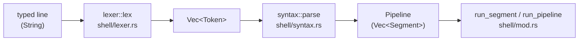

# The shell

The shell is kernel-resident: `kernel_main` ends in `shell::run`, a read-eval loop that never returns
(the role `init` plays). It is ordinary code running outside any interrupt, so a program it launches runs
with interrupts enabled. This document describes what it accepts, how it runs a line, and the state it
carries; the source is `rust/r16_brk/src/shell/` (plus `exec/frame_stack.rs` and `exec/shell_state.rs`
for its state).

Related documents:

- [`shell.ebnf`](shell.ebnf) &mdash; the grammar.
- [`console.md`](console.md) &mdash; how a line gets typed: the prompt's editing keys and history, and how
  a program's `read(0)` differs from the prompt.
- [`launching_programs.md`](launching_programs.md) &mdash; what happens once a command names a program.
- [`progs.md`](progs.md) &mdash; the programs themselves.
- [`filesystem.md`](filesystem.md) &mdash; what paths, open files and redirect targets refer to.

## From a typed line to a running command

`shell::run_line(line)` does three things, in this order:

1. **Lex** (`shell/lexer.rs`): split the line into words, `|` and redirection operators.
2. **Parse** (`shell/syntax.rs`): group the tokens into a `Pipeline`, a `Vec<Segment>`. A `Segment` is one
   command: its `argv` (the words) and its `redirs`, in the order typed.
3. **Run**: one segment runs directly (`run_segment`); several run as a pipeline (`run_pipeline`).

A blank line or a comment does nothing, quietly. A problem at any stage is reported as one line of text on
the current stderr (`shell_err`), so it is redirectable like any program's own error: a syntax error reads
`syntax error: <what>`, and launch failures use bash's wording (`nosuch: command not found`).

### The grammar and where it lives

The grammar is [`shell.ebnf`](shell.ebnf). Its implementation is split across the first two stages of the
pipeline above, each a [`peg`](https://docs.rs/peg) grammar covering part of the EBNF. Both are pure `no_std`
code with no dependency on the rest of the kernel, so their unit tests run on the development machine rather
than in QEMU (`rust/r16_brk/hosttests/`, run by `just test-host`):

- `shell/lexer.rs` implements the `token`/`redir_op` productions, over the characters of the line. Its
  output is `Token::Word { text, quoted }`, `Token::Pipe` or `Token::Redir { fd, op }`.
- `shell/syntax.rs` implements the `segment`/`pipeline` productions, over that token stream.

The EBNF describes what the shell *accepts*. Two things it deliberately leaves to the code (each is noted in
the grammar file itself): `>&`'s operand must be exactly `1` or `2` (a syntax error otherwise, from
`syntax.rs`), and `;`, `&`, `(`, `)`, `<<` and `<&` are recognized and refused with a specific "not
supported" message (from `lexer.rs`) rather than failing to parse generically.

In summary, the rules are POSIX's, as far as this shell goes:

- **Words** are separated by blanks. **Single quotes** are fully literal. Inside **double quotes**
  everything is literal except that a backslash escapes `"`, `\`, `$` and a backtick; any other backslash
  there is itself. An unquoted backslash makes the next character literal. Quoting or escaping any part of a
  word makes the whole word `quoted`.
- **`#` starts a comment only at the start of a word**: `echo a#b` prints `a#b`, `echo a #b` prints `a`.
- **Operators** `|`, `<`, `>`, `>>` and `>&` end a word. A lone digit `0` (before `<`) or `1`/`2` (before
  `>`, `>>`, `>&`), *immediately* followed by the operator, is that operator's file descriptor number
  (`2>err`); anywhere else digits are ordinary text (`a2>x` is the word `a2`, the operator `>` and the word `x`).
- **Nothing is expanded.** `$`, backtick, `*`, `?`, `~`, `{` and `}` are ordinary characters: no variables,
  no globbing, no command substitution, no tilde expansion.
- **Not supported**, and refused rather than taken for text: `;`, `&` (so no lists and no background jobs),
  `(` `)`, and here-documents (`<<`).

## Running a segment

### Program lookup

A command word is a builtin (below) if it names one, otherwise a program. A word containing `/` is a path,
relative to the working directory unless it starts with `/`; a bare name is looked up in `/bin` only, as
`name` and then `name.exe`, with no `PATH`-style search. The file must be a regular file with the executable
attribute bit set. See [`launching_programs.md`](launching_programs.md) for what happens next, including
the fallback for an executable file that isn't an ELF binary (it is run as a script).

### Redirection

A segment's redirections are applied in the order typed, **left to right**, each already in effect for the
ones after it, so `cmd > f 2>&1` and `cmd 2>&1 > f` differ (the first sends both streams to `f`; the second
sends stderr to where stdout *was*, i.e. the console).

| Written | Meaning |
|---|---|
| `< file`, `0< file` | stdin from `file` |
| `> file`, `1> file` | stdout to `file`, truncating it |
| `2> file` | stderr to `file`, truncating it |
| `>> file`, `2>> file` | the same, appending |
| `>&2`, `1>&2`, `2>&1` | make the left descriptor another name for whatever the right one is bound to *now* (the operand must be `1` or `2`) |

- A stage of only redirections (`> f`) runs nothing but still creates `f`, as POSIX does.
- If a redirection fails (the file can't be opened), the command does not run, and the earlier redirections
  on that line stay in effect &mdash; so the error message itself goes wherever an earlier `2>` sent it:
  `cmd 2> e < missing` reports the missing file into `e`.
- A builtin runs under its redirections too, and its effect on shell state sticks: `cd dir > f` still
  changes directory.
- A redirection opens the file and binds it in the segment's frame; the file stays open as long as a
  binding or a program's fd refers to it, and is closed when the segment ends and the frame's streams are
  restored, which is what commits anything written. `2>&1` shares the one file between two streams, so a
  program closing one of them leaves the other working.

### Pipelines

`a | b | c` runs the stages one after another, each stage's stdout feeding the next stage's stdin **through
a temporary file** under `/tmp/`, not a real pipe.

- Temp files are named `/tmp/.pipeN`, where `N` comes from one counter that only ever increases for the
  shell's whole lifetime (so a script run inside a pipeline, running pipelines of its own, can never collide
  with an outer pipeline's still-live file). A name that already exists is skipped, so a user's own file is
  never clobbered. All temp files are removed when the pipeline finishes.
- Every stage runs, in order, even if an earlier one failed, faulted or wasn't found (it then just sees empty
  input). Only a *setup* failure, such as a full disk or a missing `/tmp`, aborts the rest.
- A stage's own redirections apply *after* the pipe is bound, so `a > f | b` sends `a`'s output to `f` and
  `b` sees empty input, and `a 2>&1 | b` sends stderr through the pipe too.
- Because the data goes through a file, a stage's whole output is written before the next stage starts
  reading it &mdash; no streaming, and it needs free disk space. This is a permanent limitation until
  Stage 23 replaces it with real pipes between resident programs.

### Exit status

There are no variables yet, so there is no `$?`. Instead, when a *program* exits with a nonzero status, the
shell prints `exit N` on that command's stderr (inside its redirections, so `cmd 2> e` captures it too). A
program stopped by a fault reports `exit 139` (`128 + SIGSEGV`). A builtin never prints one. For a pipeline
only the **last** stage's status counts, so `false | true` prints nothing and `true | false` prints
`exit 1`. Stage 17 replaces this convention with a real `$?`.

## Builtins

Only what has to change the shell's own state is built in.

| Command | Behavior |
|---|---|
| `cd [DIR]` | Make `DIR` (absolute, or relative to the working directory) the working directory. With no operand, go to `/` (POSIX says `$HOME`; Stage 17 switches to it). `cd -`, `-L` and `-P` are refused with an explanation, as is more than one operand. On any error the directory is unchanged. |
| `export NAME[=VALUE]...` | Mark each variable **exported** -- handed to every program the shell starts, and to scripts run as their own process -- and, with a `=VALUE`, assign it first. `export NAME` for a variable that is not set does nothing. Every operand is attempted; a name that is not a valid identifier (`[A-Za-z_][A-Za-z0-9_]*`) is reported as bash does, `export: 'a-b': not a valid identifier`. `export` alone and `-p` are refused. (Stage 17, Step 1: nothing reads a variable yet -- programs get them in Step 2, `$NAME` in Step 3.) |
| `unset NAME...` | Remove each variable, set or not. An invalid name is reported; options are refused. |
| `source FILE`, `. FILE` | Run the lines of `FILE` in the *current* shell state: a `cd` inside it sticks. |
| `sh FILE` | Run the lines of `FILE` in a *scope* of its own, as a child shell process would: its `cd`s and redirections are gone afterwards. |

`cd` also accepts `--` before its operand (`cd -- -odd-name`) and rejects any other option (`cd: -x: invalid option`).
`source` and `sh` take exactly one `FILE` (`usage: source FILE`, or `too many arguments`).

`source` and `sh` resolve `FILE` against the working directory (no `/bin` search) and need no executable bit,
as in POSIX. `pwd` is not a builtin but a program (`progs.md`), reading the directory through the `getcwd`
syscall.

## Scripts and scoping

A script is a text file whose lines are each run as if typed at the prompt: blank lines and `#` comments do
nothing, and a failing line reports its error and the script carries on. There is no control flow, no
variables and no positional parameters, so extra arguments to a script are refused (`too many arguments`)
rather than silently ignored.

There are three ways to run one, differing only in scoping:

| Way | Needs exec bit | Scope |
|---|---|---|
| `./script` (an executable non-ELF file, the `ENOEXEC` fallback) | yes | scoped, like a child process |
| `sh script` | no | scoped |
| `source script`, `. script` | no | unscoped: runs against the current state |

Scripts may run other scripts, up to 16 levels deep (`too many levels of scripts` beyond that), which keeps a
script that runs itself from exhausting the kernel stack. The limit is a separate counter rather than the
frame stack's depth, because `source` never pushes a frame and would otherwise escape it.

## The shell's state: the frame stack

Everything a script or a redirect must be able to save and restore lives in one **frame**
(`exec/frame_stack.rs`): the working directory, where each of the three standard streams goes
(`StdioBinding::Default` &mdash; the keyboard for stdin, the console for stdout and stderr &mdash; or an open
file), and the shell's variables (each a name, a value and an `exported` flag: all can be read, only exported ones
are handed on to children). The frames form a stack whose bottom frame is the shell's own and is never popped. Two different
operations use it, deliberately not one:

- `with_scope` pushes the frame a *child process* would start with &mdash; the working directory and stream
  bindings, but only the **exported** variables (all of them exported) &mdash; runs, and pops: *everything* changed
  inside is gone afterwards. This is what `sh script` and `./script` use. (`source` pushes nothing: it sees and
  changes every variable.)
- `with_stdio` replaces some stream bindings on the *current* frame, runs, and puts them back &mdash; and
  nothing else, so a `cd` inside still sticks. This is what every redirection uses, builtins included.

A frame is plain data with no reference to any static, so it can become a per-process structure unchanged
when there are processes. The one stack is a static in `exec/shell_state.rs`, which also resolves paths
against the top frame's working directory and gives each newly launched program the top frame's stream
bindings. There is one stack, not one per program: at most one program is ever resident, so the shell's state
*is* the running program's state. There is deliberately no `chdir`
*syscall* yet, since with one global stack a program's `chdir` would change the shell's directory too.

## Limits

- No `;`, `&`, `(` `)`, here-documents, variables, expansion, globbing, or control flow; no job control and
  a single foreground program at a time.
- Pipes go through files under `/tmp/`, and the shell needs that directory to exist.
- No tab completion, and no history across reboots.
- `cd` with no operand goes to `/`, not `$HOME`, and `$?` doesn't exist (`exit N` instead).

## Where the code lives

| File | What it holds |
|---|---|
| `shell/mod.rs` | The read-eval loop, `run_line`, redirection, pipelines, script execution |
| `shell/lexer.rs`, `shell/syntax.rs` | The grammar (see above) |
| `shell/builtins.rs` | `cd`, `export`, `unset`, `source`, `.`, `sh` |
| `shell/environment.rs` | The parser for `/etc/environment` (pure, host-tested); `shell/mod.rs`'s `load_environment` reads it at boot |
| `shell/launch.rs` | Finding and starting a program |
| `exec/frame_stack.rs`, `exec/shell_state.rs` | The frame stack and the one global instance |
| `keyboard/`, `console/input_layout.rs` | Typing a line (see [`console.md`](console.md)) |
