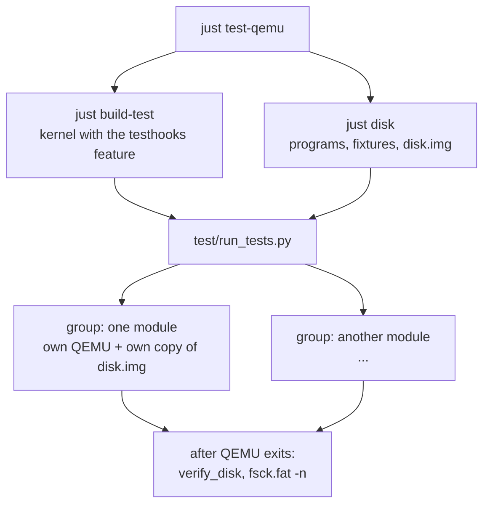

# Testing

See also: [`shell.md`](shell.md) and [`console.md`](console.md) for the behavior most of the QEMU tests exercise, and [`progs.md`](progs.md) for the programs they run.

The kernel is bare-metal AArch64 `no_std` code, so it cannot run `cargo test` on itself. `r16_brk` is
tested in two layers, both run by `just test` (in `rust/r16_brk/`), which first runs a third, cheaper check that the
docs are complete (below):

| Layer | Recipe | Runs | Good for |
|---|---|---|---|
| **Host tests** | `just test-host` | `cargo test` on the development machine, in milliseconds | Pure logic: parsers, layouts, state machines |
| **QEMU tests** | `just test-qemu` | The real kernel in headless QEMU, driven by typing on its virtio keyboard | Everything that touches hardware, syscalls, the display or the disk &mdash; and end-to-end behavior |

`just check-docs` (`test/check_docs.py`) fails if a program under `user/progs*/src/bin/` has no row in
[`progs.md`](progs.md), a syscall number in `abi` has no row in [`syscalls.md`](syscalls.md), a program in
`test/progs/` is not described in `test/README.md`, or a test program's name also exists under `user/`.
Adding a program or syscall without documenting it therefore fails `just test`.

Linting is separate and not part of `just test`: `just lint` runs clippy, with warnings denied, over every crate
the stage builds (the kernel, also with `testhooks`; `userlib`, `progs`, `progs_r12`, `test/progs`; and
`hosttests` and `abi` on the host), and is worth running every few Steps. It is clean as of Step 13b. `syscall/` additionally
warns on any `as` cast that can truncate (`clippy::cast_possible_truncation`), so a user-supplied register value
is never narrowed silently.

A behavior gets a host test when it can, and a QEMU test when it has to. Many features get both: the
lexer's grammar is host-tested, and `pipes.py` checks that a pipeline actually runs.

## Host tests

`rust/r16_brk/hosttests/` is a separate small Cargo crate (its own workspace, so it does not inherit
the kernel's dependencies). Its `src/lib.rs` contains no logic of its own: it pulls chosen kernel source
files in *by path*,

```rust
#[path = "../../src/shell/lexer.rs"]
pub mod lexer;
```

and compiles them for the host, where their ordinary `#[cfg(test)] mod tests` run. These are the same
files the kernel builds, not copies.

A module qualifies by being `no_std` + `alloc` with **no dependency on the rest of the kernel** (no
`Console`, UART, page tables or statics that only `kernel_main` populates). Currently:

| Area | Modules |
|---|---|
| Shell | `lexer`, `syntax`, `expand`, `frame_stack`, `environment`, `path` |
| Keyboard and line editing | `tokens`, `keymap`, `ring_buffer`, `line`, `history`, `util` |
| Console | `cells`, `font`, `utf8`, `input_layout` |
| Program loading | `elfparse`, `argplan`, `usermem` |

`just test-host` also runs the shared `abi` crate's own tests (`rust/user/abi/`).

- **Running.** `just test-host`, or by hand from `hosttests/`:
  `cargo test --target "$(rustc -vV | sed -n 's/^host: //p')"`. The explicit `--target` is needed because the
  kernel directory's `.cargo/config.toml` defaults to the AArch64 target. A filter works as usual
  (`... input_layout`).
- **Adding a module.** Add a `#[path]`/`pub mod` pair to `hosttests/src/lib.rs`, keeping them alphabetical.
  If the module uses another kernel module, that one has to be pulled in as well, and so does anything *it*
  needs (`line.rs` needs `tokens`, which needs `keymap`, which needs `util`'s `static_ref!`), which is why
  the dependencies of a module decide whether it can be host-tested at all.
- **Don't call code that needs kernel state.** Some statics are only populated by `kernel_main`.
  `Token::char()`, for example, unwraps `KEY_NAMES`, which is `None` on the host, so a test that reaches it
  panics. `LineBuffer::feed` is written so the mode-gated keys return before reaching it, and its tests only
  use tokens that do. Code shaped that way is testable; code that isn't gets a QEMU test instead.

## QEMU tests



`test/run_tests.py <kernel.elf> <disk.img>` boots the kernel and drives it the way a user would.
Each test *module* (in `test/cases/`) has `run(ctx)`, which types commands and checks results, and
optionally `verify_disk(ctx)`, which inspects the disk image after QEMU has gone.

### How a test observes the system

- **The serial log** mirrors the console: every finished command line, program output and shell message
  appears on the UART. This is what most checks read. Note that a finished line appears *twice* in a
  transcript of a program reading stdin (the line discipline's own echo, then the program's output), and
  `echo abc` yields `echo abc\nabc\n`: the typed line first, then what it printed.
- **The display**, through the QEMU monitor's `screendump`, for what the serial log cannot tell: which cell
  holds the cursor, whether a wrapped line scrolled correctly. `Session.screendump_settled()` waits until the
  screen stops changing, since the guest's redraw and the GPU flush lag the serial log.
- **The disk**, once QEMU has exited: files are read back with `mcopy`, directory attributes are inspected
  directly, and `fsck.fat -n` must report the image clean.
- **The kernel's own report**, from the `testhooks` build (below).

Input goes through the monitor's `sendkey` (`Session.type("text")`, `Session.keys([UP, CTRL_A, ...])`), with
a short delay between keys (`KEY_DELAY`) so the guest's 16-slot test queue is not overrun.

### Groups, sessions and parallelism

Each module normally runs in **its own group**: its own QEMU instance and its own private, sparse copy of
`disk.img`. So every module must be self-sufficient from a fresh boot &mdash; it `chmod +x`es the fixtures it
uses and never assumes a working directory or file left by another. (A module that genuinely must build on
another's leftover state can share a group with it: add it to that group's list in `GROUPS`.)

Groups run in a thread pool, at most `cpus - 1` at a time (`QEMU_TEST_WORKERS=N` overrides that: worth setting when other work is using the machine, since some checks are timing-sensitive under heavy load). Each group's PASS/FAIL lines are collected and
printed only after every group has finished, in `GROUPS` order, so the transcript reads the same however the
sessions happened to interleave. A `Kernel Panic!` or `Unexpected exception` on the serial log fails a session
at once, at the point it happened, not at the next timeout.

### The `testhooks` build

`just build-test` builds the kernel with the `testhooks` cargo feature (`just build` does not). It adds:

- a `[testhooks] console_flushes=N` line when each program ends, so tests can assert how many display flushes
  a program's output cost (the harness strips these from transcripts; `Session.flush_counts()` reads them);
- a **16-slot** keyboard token queue instead of 256, so the queue-overflow path can be reached by typing a few
  dozen keys;
- a builtin, `__overflow_kernel_stack`, that recurses until the kernel stack overflows into its guard.

### What is where

Everything test-only lives under `rust/r16_brk/test/` or `disk/tests/`, never in `user/`, which holds only
the core utilities every stage shares.

| Path | What it is |
|---|---|
| `test/check_docs.py` | The docs check above |
| `test/harness.py` | `Session` (QEMU, the monitor socket, the serial log, keys, screendumps), key names, `Context`, disk helpers |
| `test/run_tests.py` | The runner: `GROUPS`, parallel execution, `verify_disk`, `fsck.fat -n` |
| `test/cases/*.py` | One module per area (below) |
| `test/progs/` | A separate Cargo package of test-only EL0 programs: `probe` (pokes at the syscall surface and other odd inputs), `spin` (busy-waits, to type during), `overflow` (overflows the user stack) |
| `test/mkfixtures.py` | Run by `just disk`: derives an oversized program and ten malformed ELF files from real ones, so no binary blobs are checked in |
| `disk/tests/` | On the image as `/tests/`: checked-in text/binary fixtures, plus the generated `*.exe` test programs and malformed ELFs |

The kernel marks only `/bin` executable at boot, so tests `chmod +x` the programs they use from `/tests/`.

### The test modules

| Module | Covers |
|---|---|
| `core_utils` | The `user/progs` utilities through the shell, the launcher's error paths, `read(0)`: the regression baseline |
| `user_progs` | The Stage 12 programs (`mkdir`/`rm`/`mv`/`stat`), multi-operand forms, the flag additions, `--help` (`tee` is covered in `core_utils` and `pipes`) |
| `launch` | Launching by path, files that aren't programs (malformed ELFs), syscall error values, the fd limit, how `argv` is laid out on the new stack |
| `syntax`, `redirection`, `pipes`, `scripts`, `cwd` | The shell: the parser as reached from the prompt, `<` `>` `>>` `2>` `2>&1`, pipelines through `/tmp`, `source`/`sh`/`./script`, `cd` and relative paths |
| `line_discipline`, `wrapped_input`, `line_editing`, `token_queue` | Typing a line: editing at the prompt and in `read(0)`, wrapping, arrows/Home/End/Ctrl keys and history, keys queued while a program runs and the overflow note |
| `console`, `unicode` | The console write path: UTF-8 split across writes, flush counts, the segfault message, wide glyphs |
| `stack`, `stack_guard` | `stack`: the MMU and user memory at boot (translation on, WXN, PAN), page permissions, the user stack and its guard, a user stack overflow being a fault. `stack_guard`: the kernel stack's guard |
| `power` | `poweroff` and `reboot` (PSCI) |
| `clock` | The real-time clock: `clock_gettime` (through `probe clock`), and `date` -- the live clock against the host's, and exact output for chosen instants (`date -d @N`) in `America/Toronto` local time and UTC, including both daylight-saving changes of 2024 |
| `heap` | The user heap: `probe brk` drives the `brk` syscall (growing by a page and a byte, zeroed writable memory, the kernel's pointer check, shrinking, and what is refused) and `heapuse` allocates like a real program (big `Vec`, small boxes, `String`, growth, an allocation that cannot fit, reuse after a free); a program's heap is unmapped for the next |
| `assignment` | `NAME=value` alone (a shell variable, not exported until `export`) and before a command (its environment only, restored afterwards, also for an existing variable and for a pipeline stage), values that are expanded but never split, what is not an assignment (`echo A=1`, a quoted or invalid name), and a script's scope against `source`'s |
| `expansion` | `$NAME`, `${NAME}` and `$?` end to end: values, quoting, field splitting into a program's `argv` (`probe args`), a command word or redirect target that is an expansion (`ambiguous redirect`), and every source of a status (a program, a fault, 127, 126, a syntax error, a builtin, a script). The rules themselves are host tests |
| `env` | What a program is given as its environment: the shell's exported variables in `envp`, seen through `env` and `printenv` (file order, literal values, the `export`/`unset` effects, a script's scope against `source`'s), `probe env`'s layout check, and the shared `ARG_MAX` limit refusing an environment that is too big (`tests/bigenv.sh`, generated by `mkfixtures.py`) |
| `environment`, `env_bad`, `env_missing` | The shell's variables and the initial environment (`/etc/environment`, read once at boot): the boot note, the environment at the first prompt, what `export` and `unset` accept and refuse; a file with bad lines (each skipped and reported with its line number) and no file at all. A module picks the file its group boots with by setting `ENVIRONMENT` (the text, or `None` to remove it); the harness writes it into the group's copy of the image, `HOME=/` by default |
| `audit` | The programs that moved to the user heap in Stage 16: `ls` sorted by name, `tail` on stdin past the old 512 KiB buffer, `tee` past its old 8 files, and `chmod -R`/`rm -r` on a tree deeper than the kernel's open-file limit |
| `large` | Arbitrarily large binaries: `bigimage` (about 11 MiB of memory) runs and checks every byte range, a second run sees a fresh `.bss`, none of it stays mapped for the next program, and an image that cannot fit the ceiling, or a file bigger than half the kernel heap, is refused |

Two modules cannot use the normal `Session.run`/`wait_prompt` for part of what they do, since those treat a panic or
QEMU exiting as failure: `power` (for its `reboot` and `poweroff` steps, where the machine really resets or powers
off) and `stack_guard` (the kernel panics on purpose). For those steps they read the serial log and the QEMU process directly, and each runs in its own group, last in its session, since
nothing can run after.

Tests state what the behavior is *as of this stage*, with the expected text written into the check. They do not
compare against an earlier stage's kernel: each stage is a self-contained snapshot, and behavior is expected to
diverge deliberately over time (Step 4 once checked `line_discipline.py` against a transcript recorded from r11
to prove a refactor changed nothing; it was retired afterwards for that reason).

### Running one module

There is no command-line filter; to run a single module, call `run_group` on it from `test/`:

```console
> cd rust/r16_brk && just build-test disk
> python3 -c "
import sys, os
sys.path.insert(0, 'test'); os.chdir('test')
from run_tests import run_group
from cases import line_editing
for name, got, want in run_group(os.path.abspath('../r16_brk-test.elf'),
        os.path.abspath('../disk.img'), os.path.abspath('../disk'), [line_editing]):
    print('PASS' if got == want else 'FAIL', name)
"
```

### Writing a QEMU test

```python
def run(ctx):
    s, check = ctx.s, ctx.check
    check("echo prints its argument", s.run("echo hi"), "echo hi\nhi\n")
```

- `check(name, got, want)` records a PASS/FAIL; results are printed after all groups finish.
- `s.run(cmd)` types the command and returns the transcript up to the next prompt (the echoed line first).
  `s.type(...)`/`s.keys([...])` send keys without waiting, for editing before Enter.
- `wait_until(pred, what)` waits for a condition on the log **but does not move the transcript checkpoint**;
  only `wait_prompt()` (and `run`) does. So a `wait_prompt()` after several `wait_until`s returns everything
  since the last prompt, not just the latest chunk.
- Keep a test independent of history and other modules: the command history, working directory and
  `/tmp` state persist within a session, so assert on what *you* set up.
